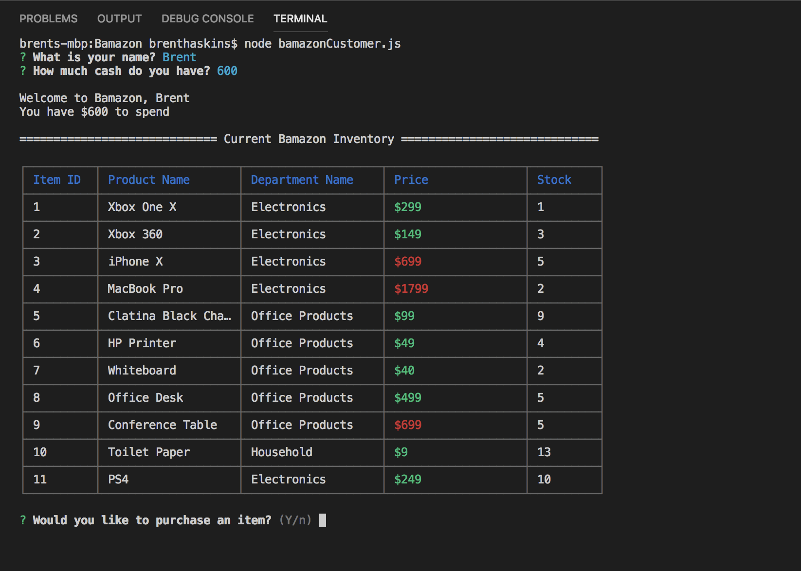
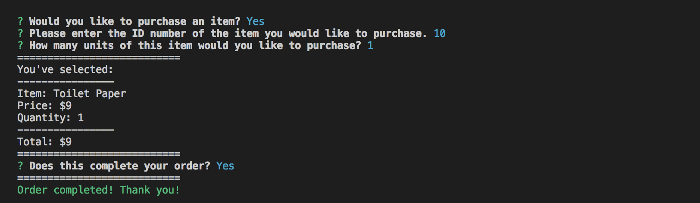
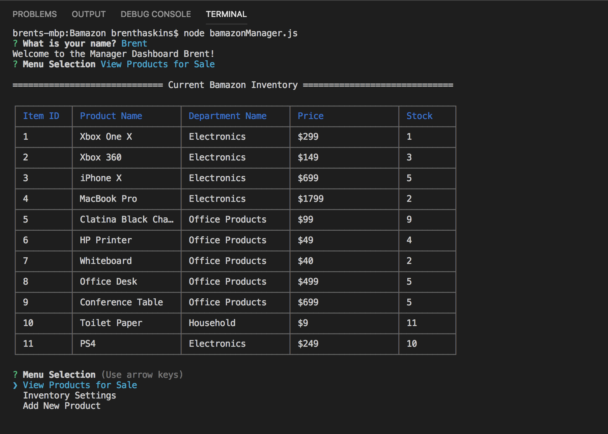
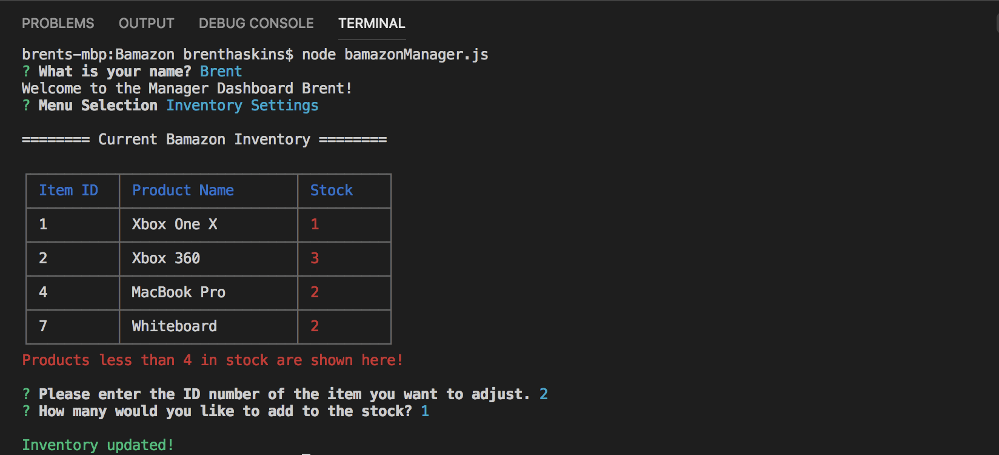
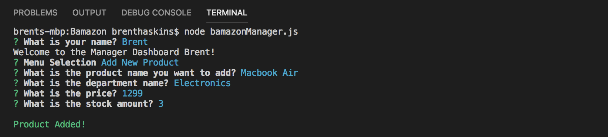

# Bamazon

Customer Dashboard - Ability to purchase item from inventory depending on the cash amount you input
Manager Dashboard - Ability to view products, increase inventory, & add new products

## Installation

Bamazon uses Mysql, Inquirer, Table, Colors

```bash
npm install mysql
npm install inquirer
npm install 
npm install cli-table
```

## Screenshots
Customer File
Main screen


Purchase screen



Manager File
View products


Inventory settings


Add new product


## Contributing

Pull requests are welcome!
